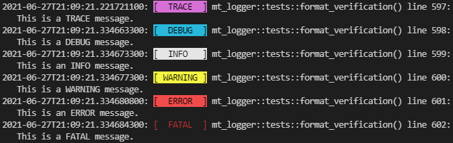

# mt_logger

`mt_logger` is a multithreaded Rust logging library focused on traceability, and ease-of-use via macros.

Logs are stored in a `logs` directory, located inside the current working directory when a program is launched. The directory will be created if it does not already exist. Log file names conform to [ISO 8601](https://en.wikipedia.org/wiki/ISO_8601), with the exception that `:` is replaced with `_` to meet Windows file naming requirements. By default, the package name (pulled from `CARGO_PKG_NAME` environment variable) is prepended to the log file name.  
Example: `cool_game_engine/logs/cool_game_engine_2021-06-27T22_08_38.474-0600.log`

At initialization, a thread is created to receive log messages and commands from the main thread. Timestamps are set before sending in order to maintain complete traceability.

## Usage
The recommended method for using `mt_logger` is via macros. A global log sender/receiver pair is created by `mt_new!()`, so all further log messages and commands can be issued simply by calling the appropriate macro, e.g., `mt_log!()` to send a log message. No passing of references to a logger instance, or cloning of an `mpsc::Sender` required!

Additionally, all macros are designed to essentially no-op when the global instance is not initialized. This allows logging to be enabled/disabled with minimal code impact. For example, a program may be designed to only call `mt_new!()` when a `-log` switch is passed in, allowing the program to run silently when the switch is omitted.

### Note
Though accurate timestamps and correct ordering of messages are guaranteed, due to the nature of multithreading, the time at which a log message is recorded to an output stream is not. The `mt_flush!()` macro addresses this issue. It will block until all queued messages in the channel are flushed to the specified output stream(s). It is recommended that this macro be called during the shutdown of a program, otherwise any queued messages will be lost.

## Contrived Example Code

```rust
use mt_logger::*;

fn main() {
    // Initialize the mt_logger global instance
    mt_new!(Level::Info, OutputStream::Both);

    // Send a log message that WILL be output to BOTH file and stdout
    mt_log!(Level::Info, "Message {}: an INFO message", 1);
    // Send a log message that WILL NOT be output
    mt_log!(Level::Debug, "Message {}: a DEBUG message", 2);

    // Change the output stream to stdout only
    mt_stream!(OutputStream::StdOut);

    // Change the logging level
    mt_level!(Level::Trace);

    // Send a log message that WILL be output to stdout ONLY
    mt_log!(Level::Info, "Message {}: an INFO message", 3);
    // Send a log message that WILL be output to stdout ONLY
    mt_log!(Level::Trace, "Message {}: a TRACE message", 4);

    // Flush to ensure all messages reach the specified output
    mt_flush!().unwrap();

    // Get a count of the number of log messages
    let msg_count = mt_count!();
    println!("Messages logged: {}", msg_count);
}
```

## Output Samples

### Console


### File
```
2021-06-27T21:09:21.221721100: [  TRACE  ] mt_logger::tests::format_verification() line 597:
   This is a TRACE message.
2021-06-27T21:09:21.334663300: [  DEBUG  ] mt_logger::tests::format_verification() line 598:
   This is a DEBUG message.
2021-06-27T21:09:21.334673300: [  INFO   ] mt_logger::tests::format_verification() line 599:
   This is an INFO message.
2021-06-27T21:09:21.334677300: [ WARNING ] mt_logger::tests::format_verification() line 600:
   This is a WARNING message.
2021-06-27T21:09:21.334680800: [  ERROR  ] mt_logger::tests::format_verification() line 601:
   This is an ERROR message.
2021-06-27T21:09:21.334684300: [  FATAL  ] mt_logger::tests::format_verification() line 602:
   This is a FATAL message.
```